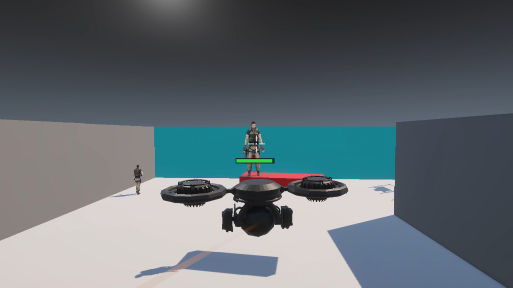
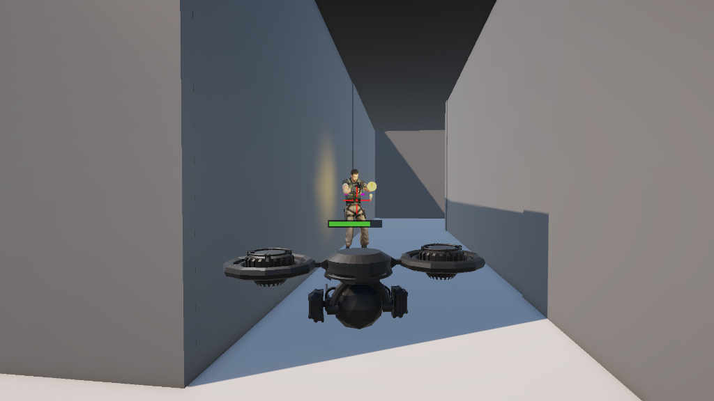
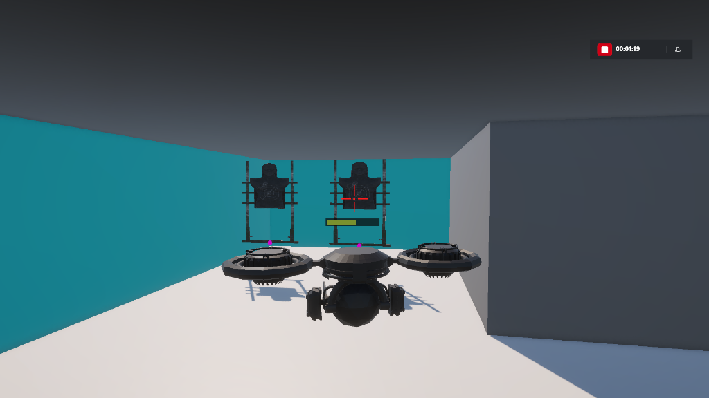

# 🚁 Drone vs Enemy Combat Simulation
### Unity Prototype — Skill Assessment Task

---

## 🎬 Demo Video

[](https://drive.google.com/file/d/1kcSOGmRwhZINNUcqREbn1u1VMf65hKVc/view?usp=sharing)

> **[▶ Click here to watch the full gameplay demo](https://drive.google.com/file/d/1kcSOGmRwhZINNUcqREbn1u1VMf65hKVc/view?usp=sharing)**

---

## 📸 Screenshots

### 🤖 Enemy AI — Patrol & Combat


### 🔫 Drone Shooting — Muzzle Flash & Soldier HP Bar  


### 🎯 Dummy Targets — Crosshair Targeting System


---

## 📖 Overview

A fully functional Unity 3D prototype where a player-controlled drone engages in combat against AI-driven enemy soldiers. The drone can fly freely, shoot bullets, and deploy bombs. Enemies patrol waypoints, detect the drone, and return fire.

---

## 🎮 Controls

| Key | Action |
|-----|--------|
| `W` | Fly Forward |
| `S` | Fly Backward |
| `A` | Strafe Left |
| `D` | Strafe Right |
| `Q` | Ascend (fly up) |
| `E` | Descend (fly down) |
| `Left Click` | Fire bullet |
| `Space` | Fire bullet (alternative) |
| `B` | Drop bomb (area blast) |
| `Mouse` | Rotate camera around drone |
| `Escape` | Unlock cursor / pause |

---

## ✅ Features Implemented

### 🚁 Player Drone
- Free 6-DOF flight with WASD + Q/E
- Smooth camera follow with mouse rotation
- World-space drone health bar with damage feedback
- Rigidbody physics with continuous collision detection (no wall clipping)

### 💣 Weapon System
- **Bullet shooting** — Left Click / Space fires physics-based bullets with tracer FX
- **Bomb drop** — `B` key drops a bomb; shooting it triggers instant area blast
- Crosshair turns **red** when aimed at a valid target (soldier or dummy)
- Muzzle flash and impact sparks on every shot
- Procedural audio: shoot crack, explosion boom, hit sounds

### 🤖 Enemy AI
- NavMesh-based patrol between waypoints
- Detection zone — when drone enters range, soldier stops and engages
- Soldiers aim and fire bullets at the drone
- Soldiers take damage with world-space health bars
- **Death animations** — normal death (Dying.fbx) + bomb death (explode skeleton)

### 🎯 Dummy Targets
- Static dummy targets tagged as destroyable objects
- Destroyed in 2–3 bullet hits with debris FX
- Instantly destroyed by bomb blast radius
- Crosshair turns red when aimed at them

### 🔊 Audio System
- Procedurally generated sounds (no audio files needed)
- Drone motor hum (looping), shoot crack, explosion boom, death whine, hit tick
- Optional: override with real AudioClip assets in Inspector

### 🌍 Environment
- Enclosed arena with wall colliders
- NavMesh baked for full AI navigation
- Dynamic lighting and shadows

---

## 📁 Project Structure

```
Assets/
├── Scripts/
│   ├── Drone/
│   │   ├── FreeDroneMovement.cs     # Flight physics
│   │   ├── DroneShooter.cs          # Bullet + bomb firing
│   │   ├── DroneHUD.cs              # Crosshair + targeting
│   │   ├── DroneHealth.cs           # Drone HP bar
│   │   └── GameAudio.cs             # Procedural audio manager
│   ├── Combat/
│   │   ├── SoldierHealth.cs         # HP bar + death animation
│   │   ├── SoldierCombat.cs         # AI attack logic
│   │   ├── Bomb.cs                  # Area blast trigger
│   │   ├── BulletTracer.cs          # Visual tracer FX
│   │   ├── DummyTarget.cs           # Destructible target
│   │   └── AnimClipPlayer.cs        # Runtime animation sampler
│   ├── Enemy/
│   │   └── Patrol.cs                # NavMesh waypoint patrol
│   └── Environment/
│       └── WallColliderSetup.cs     # Auto wall colliders
├── Prefabs/
├── Scenes/
│   └── SampleScene
└── Textures/
```

---

## ⚙️ Setup Instructions

1. Open project in **Unity 6 (6000.0.x)** with **URP**
2. Open scene: `Assets/Scenes/SampleScene`
3. Bake NavMesh: `Window → AI → Navigation → Bake`
4. Add **Game Audio** component to **DroneParent**
5. Press **▶ Play**

---

## ⚠️ Known Bugs / Limitations

- Blood/impact FX may appear pink if URP shader variant is not cached on first run
- Bomb skeleton animation requires `explode_skeleton_animated.glb` clip assigned per soldier
- No audio files included — procedural synthesis used instead

---

## 🛠️ Tech Stack

- **Engine:** Unity 6 (URP)
- **Language:** C#
- **AI Navigation:** Unity NavMesh Agent
- **Physics:** Rigidbody, RaycastAll, OverlapSphere
- **Animation:** Legacy SampleAnimation + Animator
- **Audio:** Procedural AudioClip generation (sine waves + noise)

---

## 👤 Author

**Sanjeev Krishna J**
- GitHub: [@Jsanjeevkrishna](https://github.com/Jsanjeevkrishna)
- Repository: [3d-drone](https://github.com/Jsanjeevkrishna/3d-drone)
- Demo: [Watch Gameplay](https://drive.google.com/file/d/1kcSOGmRwhZINNUcqREbn1u1VMf65hKVc/view?usp=sharing)
